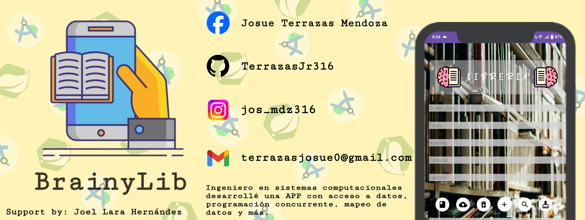
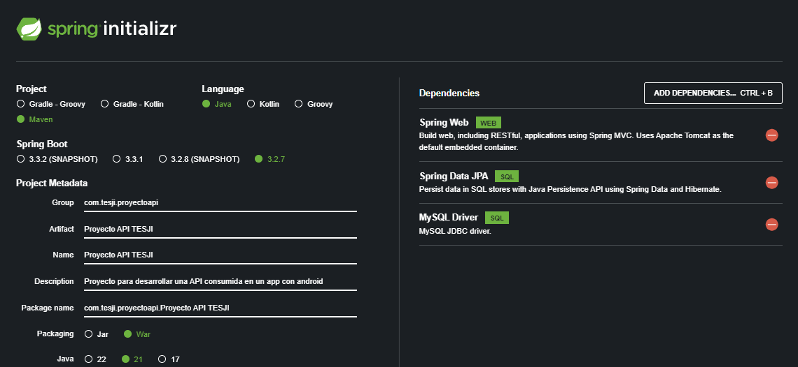

# Developing-my-API

Desarrollo mi primera API REST con IntelliJ IDEA Community Edition usando framework de Spring y uso maven como gestor de dependencias. Tiene como proposito que tenga acceso a datos usando SQL, consumirla a traves de una apliación movil en AndroidStudio y que mediante ella tenga los servicios CRUD y finalemente uso XAMPP como servidor web local.

## ¿Cómo se creo este proyecto?

Proporsiono el sitio donde se agregaron las características del proyecto para desarrollar la API REST con [Spring](https://start.spring.io/)

Una vez generado el proyecto y completado de cargar la inyección de paquetes y dependencias,

## Encuéntrame en:

 

 

